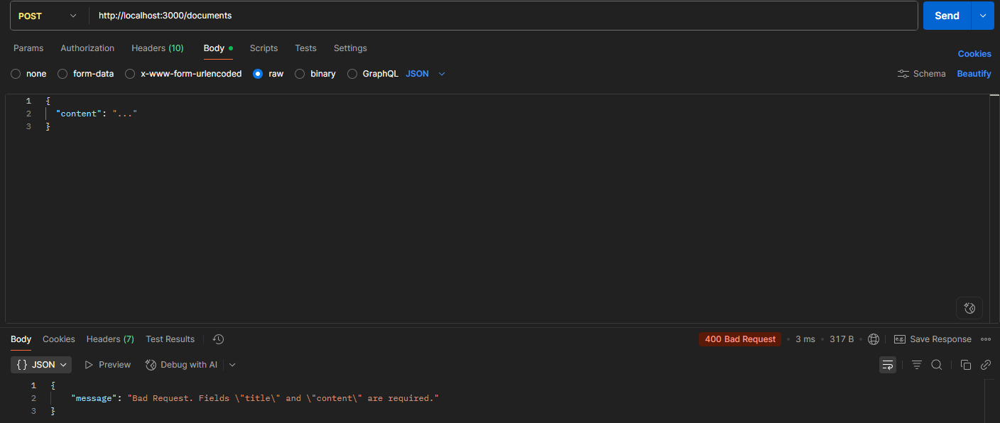

## Розробка та тестування захищеного REST API на Node.js та Express:
# Короткий опис призначення API.
REST API призначений для встановлення з'єднання із сервером. Позволяє отримувати дані, за яких сервер надсилає певну відповідь. 
Node.js це те, що виконує код відповідного файлу. У файлі вказуються що відповідати за яких умов. 

# Інструкції з встановлення залежностей та запуску.
У гітбаш треба перейти на папку репозиторію із файлами через cd, а після ввести npm install express   
Щоб запустити сервер треба ввести npm start  

# Інструкції з запуску тестового клієнта.
Для запуску тестового клієнту треба відкрити нове вікно git bush, перейти до репозиторыю та ввести npm test

# Таблиця з описом всіх реалізованих ендпоінтів.

| Метод | URL            | Заголовки                               | Тіло (Body)                                    | Очікуваний статус | Примітка                                      |
|-------|----------------|------------------------------------------|-----------------------------------------------|------------------|-----------------------------------------------|
| GET   | /documents     | X-Login: user1 X-Password: password123 | -                                             | 200 OK           | Успішне отримання даних з роллю 'user'.       |
| GET   | /employees     | X-Login: admin1 X-Password: password123 | -                                             | 200 OK           | Успішне отримання даних з роллю 'admin'.      |
| POST  | /documents     | X-Login: user1 X-Password: password123 | `{ "title": "Test Doc", "content": "..." }`   | 201 Created      | Успішне створення ресурсу.                    |
| DELETE| /documents/1   | X-Login: admin1 X-Password: password123 | -                                             | 204 No Content   | Успішне видалення. Відповідь не має тіла.     |

# Звітові скріншоти з Postman.
  
  
  
  
  
  
  
  
  
  
